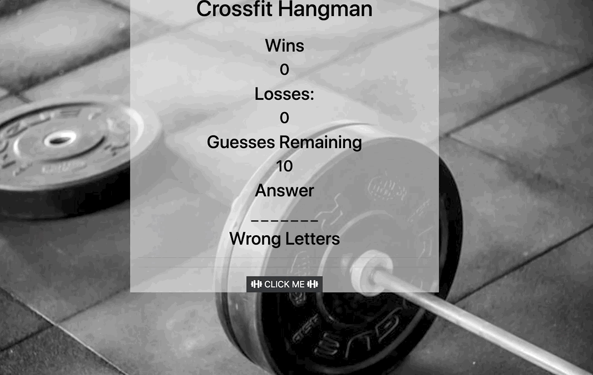

# Word-Guess-Game / Hangman Game

### Link to Live Game: 

## Game Objective:
```
--- Guess the correct word and earn a point!
```
##### Game Instructions:
```
1. Press any key to start guessing.
2. Guess letters to determine word.
3. If you guess correctly you get a point.
4. You only get 10 guesses per word.

####### Tips:
-- All the letters are logged. Pay attetnion so you don't use the same wrong letter again.
-- These are all the names of the "Girls of Crossfit".
```
## Tools/Languages Used:
```
--- Javascript
--- HTML/CSS
--- Bootstrap
--- Font Awesome
```
## Game Features:

##### Start Screen:

```
FUNCTIONALITY:
- Blank spaces displays length of random word for player to guess.
- Scoreboard displays the wins, losses, guesses left and letters guessed.
- When the correct word is guessed it is displayed on screen.
- When the user runs out of guesses the correct word is displayed.
- Game resets when user wins or looses.
- User can get one hint by clicking the button at the bottom of the page.
```
##### Hint Button:
```

```


##### Correct Answer:
```

```


##### Wrong Answer:
```

```


## Acknowledgments

* PurbpleBooth REAME.md template [PurpleBooth](https://gist.github.com/PurpleBooth/109311bb0361f32d87a2)
* Photos from [Unsplash](https://unsplash.com/)

